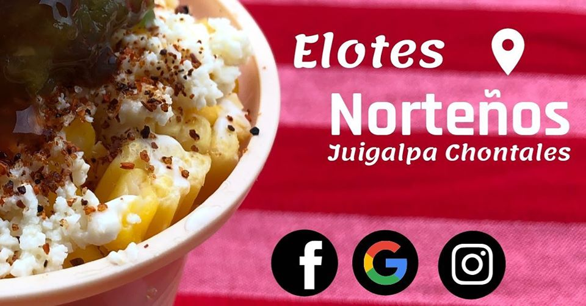
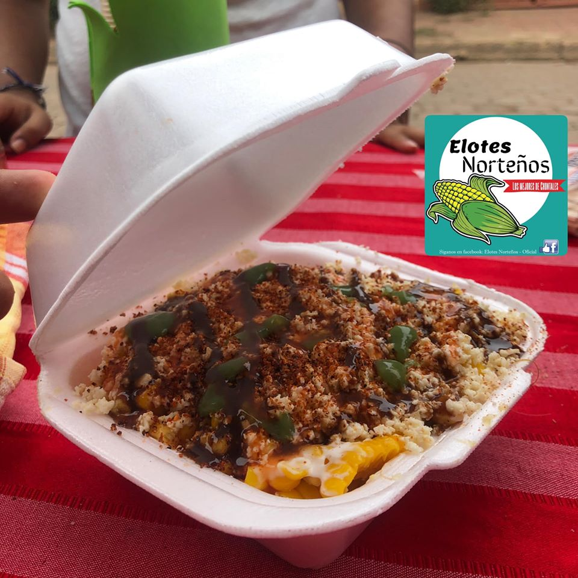
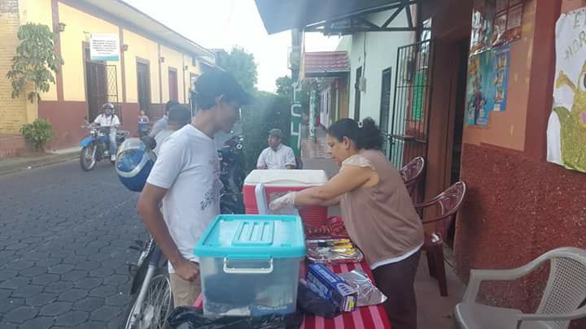
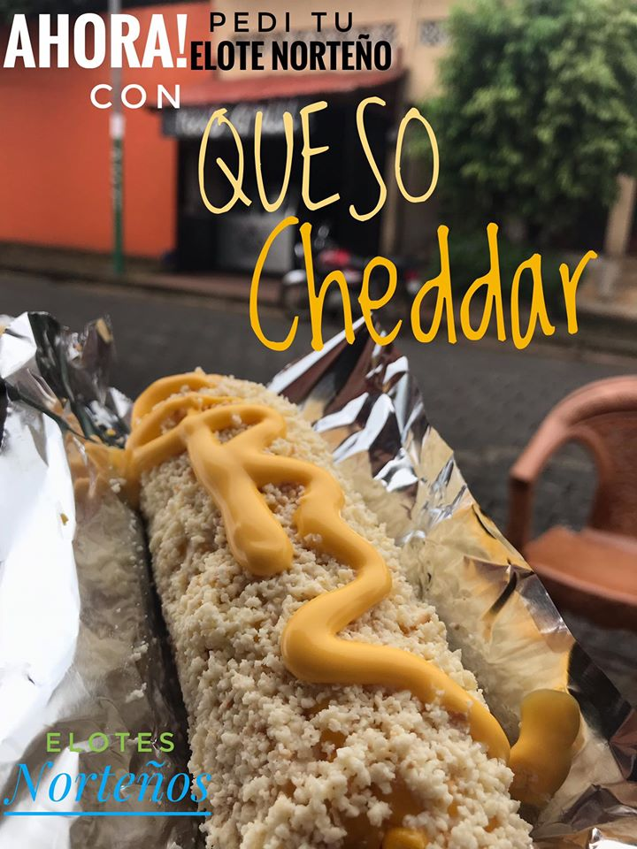

# Elotes Norteños.
Manual de Usuario.

## Autor

 * Carlos Alberto Gaitan Escoto.

## Tecnologias

 * CSS
 * JavaScrip
 * HTML5
 * Markdown

 ## Descripción

 la pagina principal se compone por el un menu sencillo que presenta al usuario los apartados principales de la pagina.

  ```html
  <div class="navbar-fixed">
        <nav class="green">
            <div class="nav-wrapper">
                <div class="container">
                    <a href="#" class="brand-logo">Elostes Norteños</a>
                    <a href="#" data-activates="mobile-menu" class="button-collapse"><i class="material-icons">menu</i></a>
                    <ul class="right hide-on-med-and-down">
                        <li><a href="#">Pagina Principal</a></li>
                        <li><a href="#">Galeria</a></li>
                        <li><a href="#">Contacto</a></li>
                    </ul>
                </div>
            </div>
        </nav>
    </div>
    <ul class="side-nav" id="mobile-menu">
        <li><a href="#">Pagina Principal</a></li>
        <li><a href="#">Galeria</a></li>
        <li><a href="#">Contacto</a></li>
    </ul>
```
sseguido se resenta un seccion de slider con imagenes referentes a la marca.
```html
  <div class="slider">
        <ul class="slides">
            <li>
                
                <div class="caption center-align ">


                </div>
            </li>
            <li>
                
                <div class="caption left-align">
                    
                </div>
            </li>
            <li>
                
                <div class="caption right-align">
                    
                </div>
            </li>
            <li>
                
                <div class="caption center-align">
                    
                </div>
            </li>
            <li>
                
                <div class="caption center-align">
                    <h3 class="darkblue-text">Mayor información!</h3>
                    <h5 class="light blue-text text-lighten-3">Les esperamos.</h5>
                    <a class="waves-effect waves-light btn green white-text" target="_blank" href="Https://www.google.com">Buscar</a>
                </div>
            </li>
        </ul>
    </div>
 ``` 
 a continuacion tenesmos informacion importante para el cliente, y por ultimo tenemos la galeria com imagenes ineditas.

